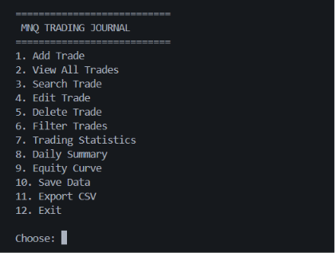
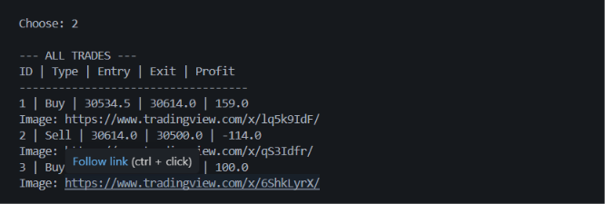
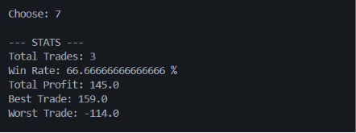

# 📈 MNQ Trading Journal

A Python-based trading journal designed for managing and analyzing MNQ (Micro E-mini Nasdaq-100 Futures) trades.

This project combines my interest in financial markets with my journey into Python, Data Analytics, and Data Science by building a practical tool for recording trades, calculating performance metrics, and preparing data for future analysis.

---

# 🎯 Project Objective

The goal of this project is to build a personal trading journal that helps traders:

- Record and manage trades
- Calculate Futures P/L automatically
- Analyze trading performance
- Store historical trade data
- Export data for further analysis

---

# 📌 What is MNQ?

MNQ (Micro E-mini Nasdaq-100 Futures) is a futures contract based on the Nasdaq-100 index.

For MNQ:

- 1 point movement = $2 per contract

The project uses MNQ-specific profit/loss calculations instead of generic price differences.

Example:

Entry:
30534.50

Exit:
30614.00

Points:
79.5

Profit:

79.5 × $2 = $159

---

# 🚀 Features

## Trade Management

✅ Add Trade

Store:

- Date
- Symbol
- Buy/Sell direction
- Entry price
- Exit price
- Lot size
- Notes
- Chart screenshot link

## Trade Analysis

The journal calculates:

- Total Trades
- Winning Trades
- Losing Trades
- Win Rate
- Total Profit/Loss
- Best Trade
- Worst Trade

## Data Storage

Implemented:

- JSON persistence
- CSV export

Data can be further analyzed using:

- Excel
- Google Sheets
- Pandas
- Power BI

## Additional Features

- Search trades
- Edit trades
- Delete trades
- Daily summary
- Equity curve tracking
- Trading screenshot reference

---

# 🛠 Technologies Used

- Python
- JSON
- CSV
- File Handling
- Lists
- Dictionaries
- Functions
- Loops
- Error Handling

---

# 📸 Screenshots

## Main Menu

## View All Trades

## Trading Statistics

---

# 📚 Python Concepts Applied

- Variables and Data Types
- Lists
- Dictionaries
- Functions
- Loops
- Conditional Statements
- Exception Handling
- File Handling
- JSON Read/Write
- CSV Export

---

# 🔮 Future Improvements

Planned upgrades:

- Streamlit dashboard
- Interactive charts
- Pandas analytics
- Automated CSV import
- Advanced trading performance metrics
- Cloud deployment

---
